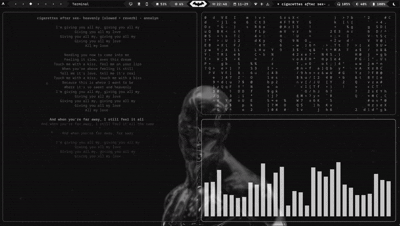

# sptlrx-scaled

A Python CLI tool that displays synchronized lyrics in your terminal, with **automatic timestamp scaling for slowed/reverb songs**.

Built as an alternative to [sptlrx](https://github.com/raitonoberu/sptlrx) with better support for YouTube Music and pitch-shifted audio.

> 🎵 *Vibe coded while listening to slowed + reverb playlists*




*Cigarettes After Sex - Heavenly (slowed + reverb) in action*

## Why I Made This

The original [sptlrx](https://github.com/raitonoberu/sptlrx) is great for Spotify, but I ran into issues when using it with YouTube Music:

1. **Slowed/reverb songs are everywhere** - These pitch-shifted versions are 20-50% longer than originals, so lyrics drift out of sync
2. **Title parsing is messy** - YouTube titles like `"Artist - Song (Slowed + Reverb) ~ chill vibes"` don't cleanly map to metadata
3. **No duration-aware matching** - When the same song exists by multiple artists, there's no way to pick the right one

### What sptlrx-scaled Does Differently

| Feature | sptlrx | sptlrx-scaled |
|---------|--------|---------------|
| Spotify support | ✅ | ❌ (browser-based players only) |
| YouTube Music | Limited | ✅ Full support |
| Slowed/reverb detection | ❌ | ✅ Auto-detects from title |
| Timestamp scaling | ❌ | ✅ Scales to match actual duration |
| Duration matching | ❌ | ✅ Uses duration to disambiguate artists |
| Lyrics source | Multiple | lrclib.net only |

## How It Works

```
┌─────────────────┐     ┌──────────────────┐     ┌─────────────────┐
│  playerctl      │────▶│  Parse title     │────▶│  lrclib.net     │
│  (MPRIS)        │     │  Strip suffixes  │     │  API lookup     │
└─────────────────┘     └──────────────────┘     └────────┬────────┘
                                                          │
┌─────────────────┐     ┌──────────────────┐              │
│  Terminal TUI   │◀────│  Scale lyrics    │◀─────────────┘
│  Display        │     │  if slowed song  │
└─────────────────┘     └──────────────────┘
```

1. Monitors playback via `playerctl` (MPRIS protocol)
2. Detects slowed songs from title patterns like `(slowed + reverb)`, `~ slowed`, etc.
3. Strips these suffixes to find the original song on lrclib.net
4. Calculates `scale_factor = current_duration / original_duration`
5. Multiplies all LRC timestamps by the scale factor
6. Displays synced lyrics in a minimal terminal UI

## Installation

### Prerequisites

```bash
# Arch Linux
sudo pacman -S playerctl python-requests

# Ubuntu/Debian
sudo apt install playerctl python3-requests

# Fedora
sudo dnf install playerctl python3-requests
```

### Setup

```bash
git clone https://github.com/YOUR_USERNAME/sptlrx-scaled.git
cd sptlrx-scaled
chmod +x main.py
```

### Running

```bash
# Run directly
python main.py

# Or make it executable
./main.py
```

Play music in your browser (YouTube Music, etc.) and lyrics will appear automatically.

## Configuration

Edit constants at the top of `main.py`:

```python
# Supported browser players (MPRIS names)
PLAYERS = ["edge", "chromium", "chrome", "firefox"]

# Cache location
SCALED_LYRICS_DIR = Path.home() / ".cache" / "sptlrx-scaled"
```

### Adding New Slowed Song Patterns

If you encounter a slowed song format that isn't detected, add a regex to `SLOWED_PATTERNS`:

```python
SLOWED_PATTERNS = [
    r'\((super\s*)?slowed\s*[\+&]?\s*reverb\)',  # (slowed + reverb)
    r'~\s*(super\s*)?slowed',                     # ~ slowed
    r'your_new_pattern_here',                     # Add new patterns
]
```

## Debugging

```bash
# Watch the debug log in real-time
tail -f ~/.cache/sptlrx-scaled/debug.log
```

Log shows:
- Song detection and parsing
- Lyrics search attempts
- Scale factor calculations
- Cache operations

## Browser Compatibility

Tested on:

| Browser | Status | Notes |
|---------|--------|-------|
| Firefox | ✅ Recommended | Full MPRIS metadata (title, artist, album, duration) |
| Microsoft Edge | ⚠️ Works | Strips album name and artist from metadata, less reliable matching |

**Firefox works best** because it exposes complete metadata through playerctl. Edge's limited metadata makes artist matching harder, so you may see more "wrong artist" issues.

## Limitations

- **Not always accurate**: Lyrics matching depends on lrclib.net having the song, and artist disambiguation can fail
- **Browser-only**: Uses MPRIS, so only works with browsers exposing media metadata (no native apps)
- **lrclib.net only**: Single lyrics source (but it's quite comprehensive)
- **Linux only**: Requires `playerctl` which is Linux-specific
- **No config file**: All settings are hardcoded (PRs welcome)

## Credits

- Inspired by [sptlrx](https://github.com/raitonoberu/sptlrx) by [@raitonoberu](https://github.com/raitonoberu)
- Lyrics provided by [lrclib.net](https://lrclib.net)

## License

MIT
